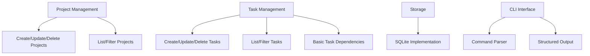
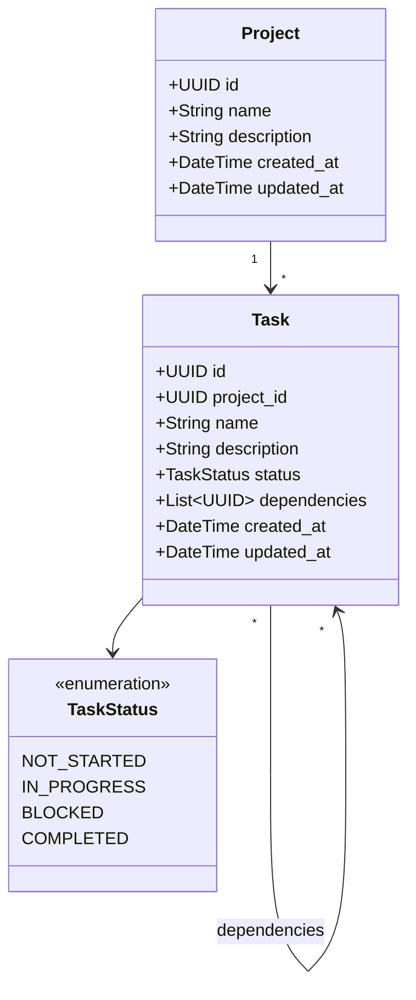

# AI-Driven Project Management Tool Plan

## 1. Overview

The `pm` CLI tool will provide a standardized way for AI assistants to manage projects and tasks. This tool will optimize for AI interaction patterns, structured data exchange, and clear state management.

## 2. Core Focus Areas



## 3. Data Model



## 4. Database Schema

### Projects Table

```sql
CREATE TABLE projects (
    id TEXT PRIMARY KEY,
    name TEXT NOT NULL,
    description TEXT,
    created_at TIMESTAMP NOT NULL DEFAULT CURRENT_TIMESTAMP,
    updated_at TIMESTAMP NOT NULL DEFAULT CURRENT_TIMESTAMP
);
```

### Tasks Table

```sql
CREATE TABLE tasks (
    id TEXT PRIMARY KEY,
    project_id TEXT NOT NULL,
    name TEXT NOT NULL,
    description TEXT,
    status TEXT NOT NULL DEFAULT 'NOT_STARTED',
    created_at TIMESTAMP NOT NULL DEFAULT CURRENT_TIMESTAMP,
    updated_at TIMESTAMP NOT NULL DEFAULT CURRENT_TIMESTAMP,
    FOREIGN KEY (project_id) REFERENCES projects (id) ON DELETE CASCADE,
    CHECK (status IN ('NOT_STARTED', 'IN_PROGRESS', 'BLOCKED', 'COMPLETED'))
);
```

### Task Dependencies Table

```sql
CREATE TABLE task_dependencies (
    task_id TEXT NOT NULL,
    dependency_id TEXT NOT NULL,
    PRIMARY KEY (task_id, dependency_id),
    FOREIGN KEY (task_id) REFERENCES tasks (id) ON DELETE CASCADE,
    FOREIGN KEY (dependency_id) REFERENCES tasks (id) ON DELETE CASCADE,
    CHECK (task_id != dependency_id)  -- Prevent self-dependency
);
```

## 5. Core Functionality

### Project Management

#### Project Model

```python
class Project:
    def __init__(self, name, description=None, id=None):
        self.id = id or str(uuid.uuid4())
        self.name = name
        self.description = description
        self.created_at = datetime.datetime.now()
        self.updated_at = self.created_at

    def validate(self):
        if not self.name:
            raise ValueError("Project name cannot be empty")
        if len(self.name) > 100:
            raise ValueError("Project name cannot exceed 100 characters")
```

#### Project Storage Operations

```python
def create_project(conn, project):
    """Create a new project in the database."""
    project.validate()
    cursor = conn.cursor()
    cursor.execute(
        "INSERT INTO projects (id, name, description, created_at, updated_at) VALUES (?, ?, ?, ?, ?)",
        (project.id, project.name, project.description, project.created_at, project.updated_at)
    )
    conn.commit()
    return project

def get_project(conn, project_id):
    """Get a project by ID."""
    cursor = conn.cursor()
    cursor.execute("SELECT * FROM projects WHERE id = ?", (project_id,))
    row = cursor.fetchone()
    if not row:
        return None
    return Project(
        id=row[0],
        name=row[1],
        description=row[2],
        # created_at and updated_at would also be set
    )

def update_project(conn, project_id, **kwargs):
    """Update a project's attributes."""
    if not kwargs:
        return get_project(conn, project_id)

    project = get_project(conn, project_id)
    if not project:
        return None

    # Update attributes
    for key, value in kwargs.items():
        if hasattr(project, key):
            setattr(project, key, value)

    project.updated_at = datetime.datetime.now()
    project.validate()

    cursor = conn.cursor()
    cursor.execute(
        "UPDATE projects SET name = ?, description = ?, updated_at = ? WHERE id = ?",
        (project.name, project.description, project.updated_at, project.id)
    )
    conn.commit()
    return project

def delete_project(conn, project_id):
    """Delete a project by ID."""
    cursor = conn.cursor()
    cursor.execute("DELETE FROM projects WHERE id = ?", (project_id,))
    conn.commit()
    return cursor.rowcount > 0

def list_projects(conn):
    """List all projects."""
    cursor = conn.cursor()
    cursor.execute("SELECT * FROM projects ORDER BY name")
    rows = cursor.fetchall()
    return [Project(
        id=row[0],
        name=row[1],
        description=row[2],
        # created_at and updated_at would also be set
    ) for row in rows]
```

### Task Management

#### Task Model

```python
class TaskStatus(enum.Enum):
    NOT_STARTED = "NOT_STARTED"
    IN_PROGRESS = "IN_PROGRESS"
    BLOCKED = "BLOCKED"
    COMPLETED = "COMPLETED"

class Task:
    def __init__(self, project_id, name, description=None, status=TaskStatus.NOT_STARTED, id=None):
        self.id = id or str(uuid.uuid4())
        self.project_id = project_id
        self.name = name
        self.description = description
        self.status = status if isinstance(status, TaskStatus) else TaskStatus(status)
        self.created_at = datetime.datetime.now()
        self.updated_at = self.created_at

    def validate(self):
        if not self.name:
            raise ValueError("Task name cannot be empty")
        if len(self.name) > 100:
            raise ValueError("Task name cannot exceed 100 characters")
        if not self.project_id:
            raise ValueError("Task must be associated with a project")
```

#### Task Storage Operations

```python
def create_task(conn, task):
    """Create a new task in the database."""
    task.validate()
    cursor = conn.cursor()
    cursor.execute(
        "INSERT INTO tasks (id, project_id, name, description, status, created_at, updated_at) VALUES (?, ?, ?, ?, ?, ?, ?)",
        (task.id, task.project_id, task.name, task.description, task.status.value, task.created_at, task.updated_at)
    )
    conn.commit()
    return task

def get_task(conn, task_id):
    """Get a task by ID."""
    cursor = conn.cursor()
    cursor.execute("SELECT * FROM tasks WHERE id = ?", (task_id,))
    row = cursor.fetchone()
    if not row:
        return None
    return Task(
        id=row[0],
        project_id=row[1],
        name=row[2],
        description=row[3],
        status=row[4],
        # created_at and updated_at would also be set
    )

def update_task(conn, task_id, **kwargs):
    """Update a task's attributes."""
    if not kwargs:
        return get_task(conn, task_id)

    task = get_task(conn, task_id)
    if not task:
        return None

    # Update attributes
    for key, value in kwargs.items():
        if hasattr(task, key):
            if key == 'status' and not isinstance(value, TaskStatus):
                value = TaskStatus(value)
            setattr(task, key, value)

    task.updated_at = datetime.datetime.now()
    task.validate()

    cursor = conn.cursor()
    cursor.execute(
        "UPDATE tasks SET project_id = ?, name = ?, description = ?, status = ?, updated_at = ? WHERE id = ?",
        (task.project_id, task.name, task.description, task.status.value, task.updated_at, task.id)
    )
    conn.commit()
    return task

def delete_task(conn, task_id):
    """Delete a task by ID."""
    cursor = conn.cursor()
    cursor.execute("DELETE FROM tasks WHERE id = ?", (task_id,))
    conn.commit()
    return cursor.rowcount > 0

def list_tasks(conn, project_id=None, status=None):
    """List tasks with optional filtering."""
    cursor = conn.cursor()
    query = "SELECT * FROM tasks"
    params = []

    if project_id or status:
        query += " WHERE"

    if project_id:
        query += " project_id = ?"
        params.append(project_id)

    if status:
        if project_id:
            query += " AND"
        query += " status = ?"
        params.append(status.value if isinstance(status, TaskStatus) else status)

    query += " ORDER BY name"

    cursor.execute(query, params)
    rows = cursor.fetchall()
    return [Task(
        id=row[0],
        project_id=row[1],
        name=row[2],
        description=row[3],
        status=row[4],
        # created_at and updated_at would also be set
    ) for row in rows]
```

### Task Dependencies

```python
def add_task_dependency(conn, task_id, dependency_id):
    """Add a dependency between tasks."""
    # Validate both tasks exist
    task = get_task(conn, task_id)
    dependency = get_task(conn, dependency_id)
    if not task or not dependency:
        return False

    # Prevent self-dependency
    if task_id == dependency_id:
        raise ValueError("A task cannot depend on itself")

    # Check for circular dependencies
    if has_circular_dependency(conn, dependency_id, task_id):
        raise ValueError("Adding this dependency would create a circular reference")

    cursor = conn.cursor()
    try:
        cursor.execute(
            "INSERT INTO task_dependencies (task_id, dependency_id) VALUES (?, ?)",
            (task_id, dependency_id)
        )
        conn.commit()
        return True
    except sqlite3.IntegrityError:
        # Dependency already exists
        return False

def remove_task_dependency(conn, task_id, dependency_id):
    """Remove a dependency between tasks."""
    cursor = conn.cursor()
    cursor.execute(
        "DELETE FROM task_dependencies WHERE task_id = ? AND dependency_id = ?",
        (task_id, dependency_id)
    )
    conn.commit()
    return cursor.rowcount > 0

def get_task_dependencies(conn, task_id):
    """Get all dependencies for a task."""
    cursor = conn.cursor()
    cursor.execute(
        "SELECT t.* FROM tasks t JOIN task_dependencies td ON t.id = td.dependency_id WHERE td.task_id = ?",
        (task_id,)
    )
    rows = cursor.fetchall()
    return [Task(
        id=row[0],
        project_id=row[1],
        name=row[2],
        description=row[3],
        status=row[4],
        # created_at and updated_at would also be set
    ) for row in rows]

def has_circular_dependency(conn, task_id, potential_dependency_id, visited=None):
    """Check if adding a dependency would create a circular reference."""
    if visited is None:
        visited = set()

    if task_id in visited:
        return False

    visited.add(task_id)

    # If the task directly depends on the potential dependency, it would create a circle
    if task_id == potential_dependency_id:
        return True

    # Check all dependencies of the task
    cursor = conn.cursor()
    cursor.execute(
        "SELECT dependency_id FROM task_dependencies WHERE task_id = ?",
        (task_id,)
    )
    for row in cursor.fetchall():
        dependency_id = row[0]
        if has_circular_dependency(conn, dependency_id, potential_dependency_id, visited):
            return True

    return False
```

## 6. CLI Interface

### Command Structure

We'll use the Click library to implement the CLI interface:

```python
import click
import json
import sqlite3
from pm.models import Project, Task, TaskStatus
from pm.storage import (
    create_project, get_project, update_project, delete_project, list_projects,
    create_task, get_task, update_task, delete_task, list_tasks,
    add_task_dependency, remove_task_dependency, get_task_dependencies
)

@click.group()
def cli():
    """Project management CLI for AI assistants."""
    pass

# Project commands
@cli.group()
def project():
    """Manage projects."""
    pass

@project.command("create")
@click.option("--name", required=True, help="Project name")
@click.option("--description", help="Project description")
def project_create(name, description):
    """Create a new project."""
    conn = get_db_connection()
    try:
        project = Project(name=name, description=description)
        project = create_project(conn, project)
        click.echo(json.dumps({
            "status": "success",
            "data": project.__dict__
        }))
    except Exception as e:
        click.echo(json.dumps({
            "status": "error",
            "message": str(e)
        }))
    finally:
        conn.close()

@project.command("list")
def project_list():
    """List all projects."""
    conn = get_db_connection()
    try:
        projects = list_projects(conn)
        click.echo(json.dumps({
            "status": "success",
            "data": [p.__dict__ for p in projects]
        }))
    except Exception as e:
        click.echo(json.dumps({
            "status": "error",
            "message": str(e)
        }))
    finally:
        conn.close()

@project.command("show")
@click.argument("project_id")
def project_show(project_id):
    """Show project details."""
    conn = get_db_connection()
    try:
        project = get_project(conn, project_id)
        if project:
            click.echo(json.dumps({
                "status": "success",
                "data": project.__dict__
            }))
        else:
            click.echo(json.dumps({
                "status": "error",
                "message": f"Project with ID {project_id} not found"
            }))
    except Exception as e:
        click.echo(json.dumps({
            "status": "error",
            "message": str(e)
        }))
    finally:
        conn.close()

@project.command("update")
@click.argument("project_id")
@click.option("--name", help="New project name")
@click.option("--description", help="New project description")
def project_update(project_id, name, description):
    """Update a project."""
    conn = get_db_connection()
    try:
        kwargs = {}
        if name is not None:
            kwargs["name"] = name
        if description is not None:
            kwargs["description"] = description

        project = update_project(conn, project_id, **kwargs)
        if project:
            click.echo(json.dumps({
                "status": "success",
                "data": project.__dict__
            }))
        else:
            click.echo(json.dumps({
                "status": "error",
                "message": f"Project with ID {project_id} not found"
            }))
    except Exception as e:
        click.echo(json.dumps({
            "status": "error",
            "message": str(e)
        }))
    finally:
        conn.close()

@project.command("delete")
@click.argument("project_id")
def project_delete(project_id):
    """Delete a project."""
    conn = get_db_connection()
    try:
        success = delete_project(conn, project_id)
        if success:
            click.echo(json.dumps({
                "status": "success",
                "message": f"Project with ID {project_id} deleted"
            }))
        else:
            click.echo(json.dumps({
                "status": "error",
                "message": f"Project with ID {project_id} not found"
            }))
    except Exception as e:
        click.echo(json.dumps({
            "status": "error",
            "message": str(e)
        }))
    finally:
        conn.close()

# Task commands
@cli.group()
def task():
    """Manage tasks."""
    pass

@task.command("create")
@click.option("--project", required=True, help="Project ID")
@click.option("--name", required=True, help="Task name")
@click.option("--description", help="Task description")
@click.option("--status", type=click.Choice(["NOT_STARTED", "IN_PROGRESS", "BLOCKED", "COMPLETED"]),
              default="NOT_STARTED", help="Task status")
def task_create(project, name, description, status):
    """Create a new task."""
    conn = get_db_connection()
    try:
        task = Task(
            project_id=project,
            name=name,
            description=description,
            status=status
        )
        task = create_task(conn, task)
        click.echo(json.dumps({
            "status": "success",
            "data": task.__dict__
        }))
    except Exception as e:
        click.echo(json.dumps({
            "status": "error",
            "message": str(e)
        }))
    finally:
        conn.close()

# Additional task commands would be implemented similarly

# Task dependency commands
@task.group()
def dependency():
    """Manage task dependencies."""
    pass

@dependency.command("add")
@click.argument("task_id")
@click.option("--depends-on", required=True, help="Dependency task ID")
def dependency_add(task_id, depends_on):
    """Add a task dependency."""
    conn = get_db_connection()
    try:
        success = add_task_dependency(conn, task_id, depends_on)
        if success:
            click.echo(json.dumps({
                "status": "success",
                "message": f"Dependency added: {task_id} depends on {depends_on}"
            }))
        else:
            click.echo(json.dumps({
                "status": "error",
                "message": "Failed to add dependency"
            }))
    except Exception as e:
        click.echo(json.dumps({
            "status": "error",
            "message": str(e)
        }))
    finally:
        conn.close()

@dependency.command("remove")
@click.argument("task_id")
@click.option("--depends-on", required=True, help="Dependency task ID")
def dependency_remove(task_id, depends_on):
    """Remove a task dependency."""
    conn = get_db_connection()
    try:
        success = remove_task_dependency(conn, task_id, depends_on)
        if success:
            click.echo(json.dumps({
                "status": "success",
                "message": f"Dependency removed: {task_id} no longer depends on {depends_on}"
            }))
        else:
            click.echo(json.dumps({
                "status": "error",
                "message": "Dependency not found"
            }))
    except Exception as e:
        click.echo(json.dumps({
            "status": "error",
            "message": str(e)
        }))
    finally:
        conn.close()

def get_db_connection():
    """Get a connection to the SQLite database."""
    # This would be configured to use the appropriate database file
    conn = sqlite3.connect("pm.db")
    conn.row_factory = sqlite3.Row
    return conn

if __name__ == "__main__":
    cli()
```

## 7. Error Handling

We'll implement a consistent error handling approach:

1. **Validation Errors**: Raised when input data doesn't meet requirements
2. **Not Found Errors**: Raised when requested resources don't exist
3. **Dependency Errors**: Raised for circular dependencies or other constraint violations
4. **Storage Errors**: Raised for database-related issues

All errors will be caught and returned as structured JSON responses:

```json
{
  "status": "error",
  "message": "Detailed error message",
  "code": "ERROR_CODE" // Optional error code
}
```

## 8. Implementation Steps

### Phase 1: Project Setup (Day 1)

1. Create project structure

   ```
   mkdir -p pm/pm tests
   touch pm/__init__.py pm/pm/__init__.py tests/__init__.py
   ```

2. Set up virtual environment

   ```
   python -m venv venv
   source venv/bin/activate  # On Windows: venv\Scripts\activate
   ```

3. Create pyproject.toml

   ```toml
   [build-system]
   requires = ["setuptools>=42", "wheel"]
   build-backend = "setuptools.build_meta"

   [project]
   name = "pm"
   version = "0.1.0"
   description = "Project management CLI for AI assistants"
   readme = "README.md"
   requires-python = ">=3.9"
   license = {text = "MIT"}
   dependencies = [
       "click>=8.0.0",
       "sqlalchemy>=2.0.0",
   ]

   [project.scripts]
   pm = "pm.cli:cli"

   [project.optional-dependencies]
   dev = [
       "pytest>=7.0.0",
       "black>=23.0.0",
       "isort>=5.0.0",
   ]
   ```

4. Install development dependencies
   ```
   pip install -e ".[dev]"
   ```

### Phase 2: Database Implementation (Day 1-2)

1. Create database schema module

   - Implement table creation scripts
   - Add schema version tracking
   - Create database initialization function

2. Implement data models

   - Create Project and Task classes
   - Add validation methods
   - Implement serialization/deserialization

3. Implement storage operations
   - Create CRUD functions for projects
   - Create CRUD functions for tasks
   - Implement dependency management functions

### Phase 3: CLI Implementation (Day 2-3)

1. Set up command structure

   - Create main CLI entry point
   - Implement command groups

2. Implement project commands

   - Create, read, update, delete operations
   - List and filtering functionality

3. Implement task commands

   - Create, read, update, delete operations
   - Status management
   - Dependency tracking

4. Add JSON output formatting
   - Implement consistent response structure
   - Add error handling

### Phase 4: Testing and Documentation (Day 3-4)

1. Write unit tests

   - Test data models
   - Test storage operations
   - Test CLI commands

2. Create documentation

   - Write README.md
   - Add command documentation
   - Create example usage guide

3. Implement integration tests
   - Test end-to-end workflows
   - Verify data persistence

## 9. Technical Stack Details

### Python Libraries

- **Click**: For CLI command parsing and handling

  - Provides nested command groups
  - Handles argument parsing and validation
  - Supports help text generation

- **SQLite3**: For data storage

  - Lightweight, file-based database
  - No separate server required
  - Transaction support for data integrity

- **SQLAlchemy (Core)**: For database operations

  - SQL expression language
  - Connection pooling
  - Transaction management

- **Pytest**: For testing
  - Fixture support for test setup
  - Parameterized testing
  - Coverage reporting

### Project Structure Details

```
pm/
├── README.md                 # Project documentation
├── pyproject.toml            # Project metadata and dependencies
├── pm/                       # Main package
│   ├── __init__.py           # Package initialization
│   ├── cli.py                # CLI command definitions
│   ├── models.py             # Data models (Project, Task)
│   ├── storage.py            # Storage implementation
│   ├── db.py                 # Database connection and schema
│   └── utils.py              # Utility functions
└── tests/                    # Test directory
    ├── __init__.py           # Test package initialization
    ├── conftest.py           # Test fixtures
    ├── test_cli.py           # CLI tests
    ├── test_models.py        # Model tests
    ├── test_storage.py       # Storage tests
    └── test_integration.py   # End-to-end tests
```

## 10. Future Enhancements

While focusing on the core functionality first, we've identified these potential enhancements for future phases:

1. **AI Metadata**: Track AI-specific information about tasks
2. **Handoff System**: Implement structured handoff between AI sessions
3. **Advanced Storage**: Add support for different storage backends
4. **Remote Synchronization**: Enable collaboration between multiple instances
5. **Graph Capabilities**: Implement advanced dependency visualization and analysis

These enhancements will build upon the solid foundation established in the initial implementation.
